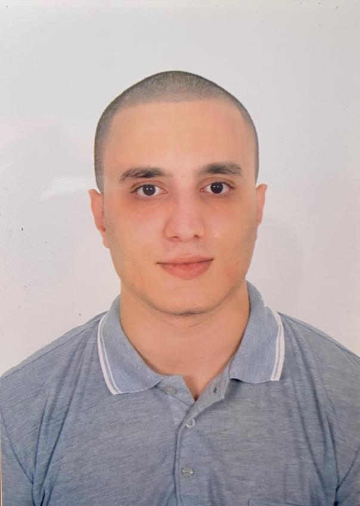

<h1 align="center"><b>Hi , I'm Almahdi Achbab </b></h1>

    

 

	
## <picture></picture> **About me**

<picture></picture>
 
 
- A passionate Self-taught Front-end developer
 
- Playing CTF's at spare time
 
- Currently learning Web Development by Self
<!--  
- Personal website [link](https://www.0xabdulkhalid.ml)](https://drive.google.com/file/d/1QANiqZKgPCCQhJPJUCD4OVCIkkq6R729/view?usp=sharing) -->
 
- I’m currently open for an Intern or a new job opportunity. This is <a href="https://drive.google.com/file/d/1QANiqZKgPCCQhJPJUCD4OVCIkkq6R729/view?usp=sharing)">My Resume</a>.

 
 

  

## <b> Skills</b>
 

- **Languages**:
    
    
    
    
    
    
    

    
    
- **Front-End Development**:

   
   
   
   
   

 

- **Back-End Development**:

    
    
    

    
 

- **Softwares and Tools**:

    
    
    
    
     

 

- **Extras**:

    

 
 

  

##  **Spoken Languages**
 

- 
- 
- 
- 

 
## <b> Let's Connect..!</b>
 

<ul>

<li>

</li>
</ul>

 

 
